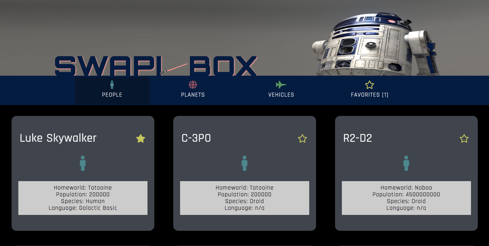

# SWAPI-box
A web-based React app created using data from the Star Wars API. Users can search through the database to find their favorite characters, planets, and vehicles. If they click the 'star/favorites' button they can save their favorite cards to local storage and see a collection of them in the favorites section of the app. 

## Final App Screenshot:

## Main Page Wireframe:

## Component Wireframe:

## Installation Steps:
Clone the repo: git clone https://github.com/ericweissman/icecream_whateverly.git
Install dependencies: npm install
Start Local Host: npm start
For testing suite: npm test

## Primary Technologies Used:
- React
- SCSS
- Jest
- Enzyme

## Future Enhancements: 
- Make ScrollText random Starwars movie rather than preset Starwars movie
- Add loading icon to home screen while waiting for Fetch requests
- More indepth testing of async Fetch requests
